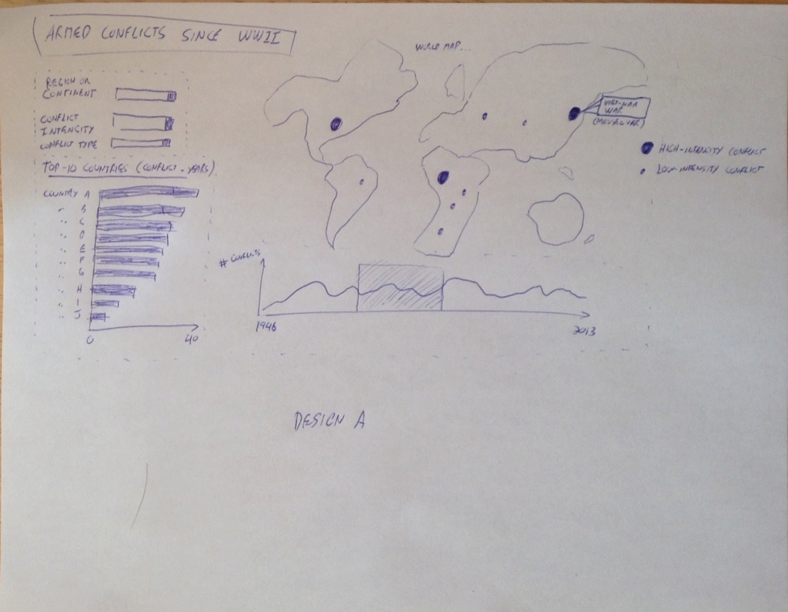
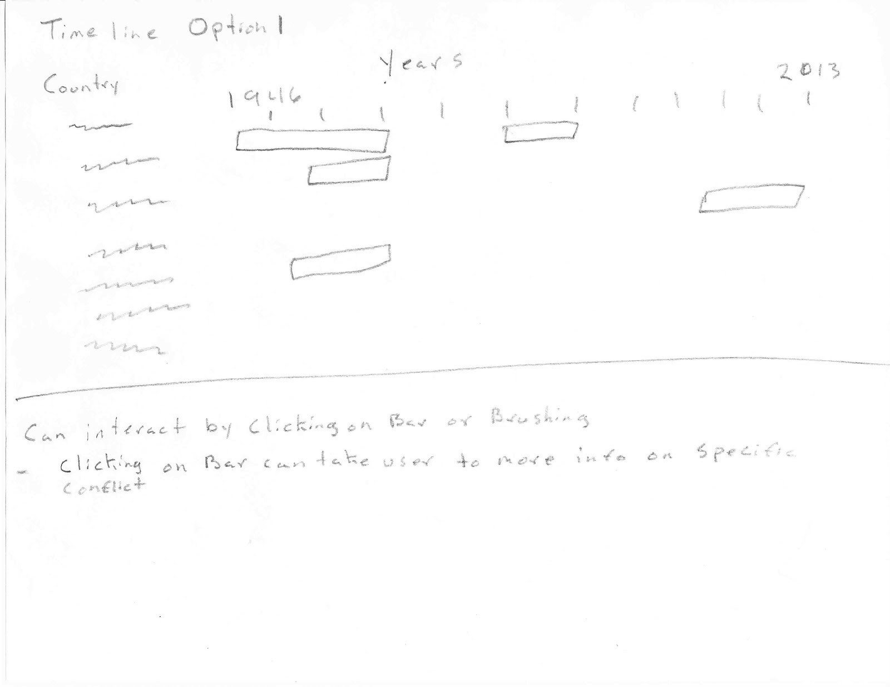

**Project Proposal : Visualizing Modern History Armed Conflicts**
-----------------------------
by Yvan Gauthier and Ed Gonzalez

**Background and Motivation**
-----------------------------
*Discuss your motivations and reasons for choosing this project, especially any background or research interests that may have influenced your decision.*

One of us (Yvan) works as a defence scientist for the Department of National Defence in Canada, so from a professional perspective, he is interested in  military topics. The other team member (Ed) was  primarily interested in working on a rich data set with multiple spatial and temporal dimensions that could be explored through interactive visualization.

For this project, we had to select a topic that did not require the use of classified or sensitive material.  In the end, we decided to concentrate on the recent history (post-WWII) of armed conflicts in the world, a topic that is fully unclassified and for which we were able to find appropriate data sets.  

**Project Objectives**
---------------------
*Provide the primary questions you are trying to answer with your visualization. What would you like to learn and accomplish? List the benefits.*

Hundreds of armed conflicts, large and small, have occured in the world since World War II (WWII).  This is a lot of data for anybody to grasp.  We want to produce an interactive visualization that will effectively convey information on armed conflicts and allow users to answer various questions, such as:

* Where in the world (countries and regions) have armed conflicts occurred since WWII?
* What was the magnitude and duration of these conflicts?
* How many casualties resulted from the conflicts?
* How many conflicts has a particular country been involved in over a given period of time (or similarly, how many conflict-years a particular country went through during a specific period of time) ?
* Is there any downward/upward trend in the number of armed conflicts, either  worldwide or in specific regions of interest?
* Do these trends, if any, differ depending on the type and intensity of the conflict?

We will design the visualisation with a general, non-specialist audience in mind.  We expect it to be of interest to military historians and defence analysts as well.

**Data**
---------
*From where and how are you collecting your data? If appropriate, provide a link to your data sources.*

Will will primarily use the [Armed Conflict Dataset](http://www.pcr.uu.se/research/ucdp/datasets/ucdp_prio_armed_conflict_dataset/) compiled by the University of Uppsala Conflict Data Program (UCDP) and the International Peace Research Institute, Oslo (PRIO).  We will also use the [Uppsala Conflict Database Categorical Variables] (http://www.pcr.uu.se/research/ucdp/datasets/uppsala_conflict_database_categorical_variables/) to make the primary data set richer.  It includes, for instance, the number of casualties to the data.  In addition, we expect to
use [topoJSON data from Mike Bostock](https://github.com/mbostock/topojson/tree/master/examples) to draw a world map.  If time permits, we may use a data set on [Sexual Violence in Armed Conflict](http://www.sexualviolencedata.org/) to add more dimensions to our data.

**Data Processing**
-------------------
*Do you expect to do substantial data cleanup?*

At first glance, not much data cleaning will be required, but we will have to fill some gaps and combine data from multiple spreadsheets.  For instance, the end dates of conflicts do not appear in all rows, so that will need to be fixed.  We will have to match countries' IDs to countries' names, which will also need manipulation (for instance, the database typically refer to "Government of Country *x*" instead of "Country *x*" when listing opponents).  We will also have to add the latitude and the longitude of countries' centroids (or capital cities) to the country data.

*What quantities do you plan to derive from your data?*

Minimally, we will have to estimate the duration of conflicts, from start and end dates (when available and when the conflict did terminate).  We may have to derive other quantities as well, such as the number of conflict-years within a for a particular country within a particular period of time.

*How will data processing be implemented?*

1. We will fill out missing data (e.g., missing end dates) in the spreadsheets.

2. We will combine data from separate spreadsheets.

3. We will convert the CSV to JSON.

4. We  will proceed to some data wrangling within the visualization (e.g., counting conflict-years within a particular period of time for a specific country).

**Visualization**
------------------
*How will you display your data? Provide some general ideas that you have for the visualization design. Include sketches of your design.*

Minimally, we want to display the temporal and spatial aspects of conflicts in a simulataneous fashion.  We foresee a world map at the top of the design, and one (or more) temporal plots at the bottom showing how different variables changed over time.  There would also be pulldown menus to filter the data according to specific variable (e.g, intensity, type, region of conflict).  

The following skecth is a first draft design from Yvan we considered to display the data.

Design A: Minimalistic design with a world map, temporal plot, and filters. 

The sketch above only presents a single temporal plot.  We would ideally have more than one temporal plot in the overall design.  We are considering to add a timeline in the form of a Gantt chart (or similar) to show when conflicts occured over time.  Here is a sketch by Ed showing how this would be done.  

Timeline example sketch 

*Must-Have Features. These are features without which you would consider your project to be a failure.*

World map wih conflict locations and magnitudes, temporal plot of conflicts (with brushing), filters on conflict intensity, type, and region.

*Optional Features. Those features which you consider would be nice to have, but not critical.*
Additional temporal plots (cross-filtered with the other components of the visualization), arcs or links between adverserial countries.

**Project Schedule**
-------------------
**By Apr 10th** : Obtain data, clean it, fill out gaps, combine it, convert to JSON, settle on design of initial implementation.  

**By Apr 17th** : Milestone 1 complete with page layout, code structure in place, process book started, and partial/prototype implementation working.

**By Apr 23rd** : First implementation completed with all must-have features working ready for feedback by TF.

**By Apr 30th** : Modifications made based upon feedback received, optional features implemented.

** By May 5th**:  Complete work, make page public, record screencast, and submit project.